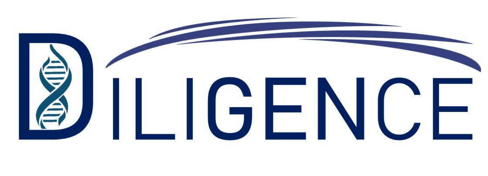

# diligence.github.io

#HNSCC - Head & Neck Squamous Cell Carcinoma
Head  and  neck  squamous  cell  carcinoma  is  the  8th  most  common  cancer.  The  tobacco consumption triggers the field of cancerisation which leads to a cancer. Moreover, the diagnostic of this cancer is often too late. HNSCC  is  know  to  be  difficult  for  the  practice  of  conventional  biopsy.  That’s  why  our  team named  DILIGENCE  thought  about  an  innovative  biopsy  less  painful  and  less  invasive  which  is the  liquid  biopsy.  

Objectives
----
Our  objective  is  to  act  as  quickly  as  possible  before  relapses  or  second primary tumors which are really common and explained the poor prognosis. Secondly, we want to  ensure  a  precision  follow-up  for  each  patient.  We  want  to  provide  an  early  diagnosis  of HNSCC  with  the  help  of  liquid  biopsy  kits  analyzed  by  a  machine  incorporating  AI  which precisely give prognostics of the risk of recurrence thanks to clinical and NGS data. This will be focus  on  genes  panel  known  to  be  altered  in  HNSCC.  This  will  allow  to  reduce  coast  and  be more effective for the Public Health and Hospital 

Logo of Our Company

Inline-style: 

